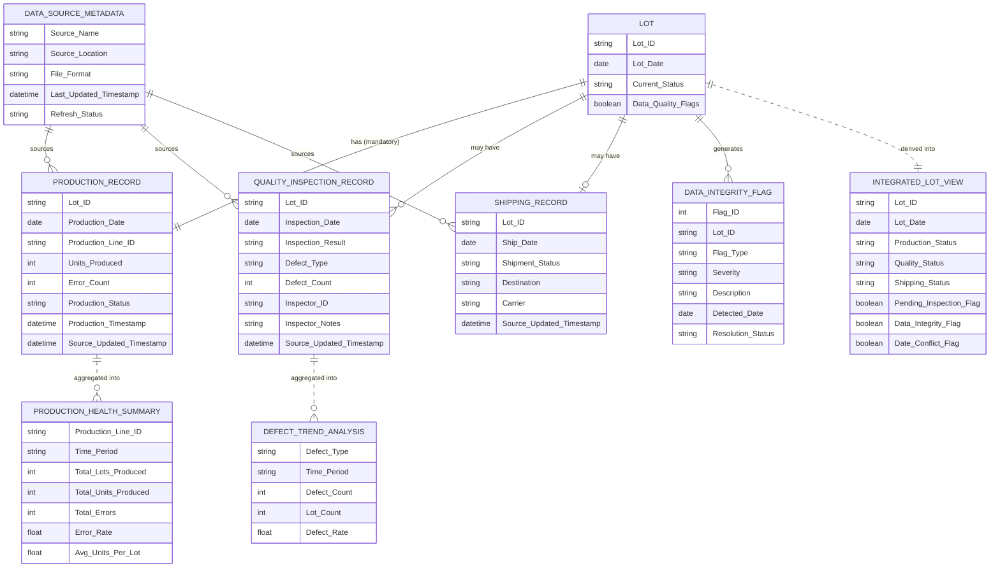
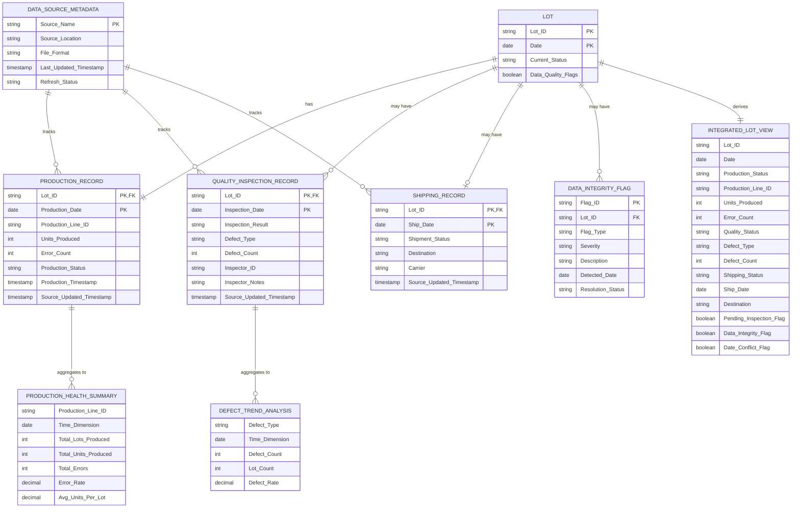

# Operations Integrated Data Model (Extracted by ChatGPT)

## 1. Core Data Entities

### 1.1 Lot
**Description:**  
Central conformed entity that unifies Production, Quality, and Shipping data.

**Primary Key**
- Lot ID
- Date  
*(Composite Business Key)*

**Attributes**
- Current Status (Derived)
- Data Quality Flags (Derived)

---

### 1.2 Production Record
**Source:** Production Logs (CSV)

**Primary Key**
- Lot ID
- Production Date

**Attributes**
- Production Line ID
- Units Produced
- Error Count
- Production Status
- Source Updated Timestamp

---

### 1.3 Quality Inspection Record
**Source:** Quality Inspection Files (XLSX / CSV)

**Primary Key**
- Lot ID
- Inspection Date

**Attributes**
- Inspection Result (Pass / Fail)
- Defect Type (Cosmetic, Functional, etc.)
- Defect Count
- Inspector ID
- Source Updated Timestamp

---

### 1.4 Shipping Record
**Source:** Shipping Logs (XLSX)

**Primary Key**
- Lot ID
- Ship Date

**Attributes**
- Shipment Status
- Destination
- Carrier
- Source Updated Timestamp

---

### 1.5 Source Metadata
**Description:**  
Operational metadata used for monitoring data freshness and health.

**Primary Key**
- Source Name

**Attributes**
- Source Location (SharePoint / OneDrive / Network Drive)
- Last Updated Timestamp
- Refresh Status (Healthy / Stale / Error)

---

## 2. Derived / Analytical Entities

### 2.1 Integrated Lot View
**Description:**  
Unified analytical view used for operational reporting.

**Derived From**
- Lot
- Production Record
- Quality Inspection Record
- Shipping Record

**Attributes**
- Lot ID
- Date
- Production Status
- Quality Status
- Shipping Status
- Pending Inspection Flag
- Data Integrity Flag
- Date Conflict Flag

---

### 2.2 Defect Trend
**Description:**  
Supports defect trend analysis over time.

**Attributes**
- Defect Type
- Date / Week
- Defect Count
- Lot ID (Optional)

---

### 2.3 Production Health Summary
**Description:**  
Weekly production performance and error analysis.

**Attributes**
- Production Line ID
- Week
- Total Lots
- Total Errors
- Error Rate

---

## 3. Entity Relationships

### 3.1 Lot → Production Record
- **Cardinality:** 1 : 1
- **Mandatory:** Yes
- **Join Key:** Lot ID + Production Date

---

### 3.2 Lot → Quality Inspection Record
- **Cardinality:** 1 : 0..1
- **Mandatory:** No
- **Join Key:** Lot ID + Inspection Date
- **Business Rule:**  
  Missing Quality record → `Pending Inspection = TRUE`

---

### 3.3 Lot → Shipping Record
- **Cardinality:** 1 : 0..1
- **Mandatory:** No
- **Join Key:** Lot ID + Ship Date

**Validation Rules**
- Shipping exists without Quality → `Data Integrity Flag = TRUE`
- Ship Date < Production Date → `Date Conflict Flag = TRUE`

---

### 3.4 Source Metadata → Source Records
- **Cardinality:** 1 : Many
- **Applies To:** Production, Quality, Shipping

---

# Operations Integrated Data Model (Extracted by Claude)

## Data Entities

### 1. Lot
- **Lot ID** (Primary Key component)
- **Date** (Primary Key component)
- Status (e.g., In Production, Failed Quality, Shipped, Pending Inspection)

### 2. Production Log
- **Lot ID** (Foreign Key)
- **Production Date** (Foreign Key)
- Production Line
- Error Count
- Production Timestamp
- Source: CSV file

### 3. Quality Inspection
- **Lot ID** (Foreign Key)
- **Inspection Date** (Foreign Key)
- Defect Type (e.g., Cosmetic, Functional)
- Inspection Result (Pass/Fail)
- Inspector Notes
- Source: XLSX/CSV file

### 4. Shipping Log
- **Lot ID** (Foreign Key)
- **Ship Date** (Foreign Key)
- Shipment Status
- Destination
- Carrier
- Source: XLSX file

### 5. Data Source Metadata
- Source Name (Quality Inspection, Shipping Logs, Production Logs)
- Last Updated Timestamp
- File Location (SharePoint, OneDrive, Local Network Drive)
- File Format (XLSX, CSV)
- Refresh Status

### 6. Data Integrity Flag
- **Lot ID** (Foreign Key)
- Flag Type (e.g., Missing Quality Record, Date Logic Error, Orphaned Shipment)
- Severity
- Description
- Detected Date

## Relationships

### Primary Relationships

1. **Lot ← Production Log** (1:1 or 1:Many)
   - Composite key: Lot ID + Date
   - A lot may have multiple production entries

2. **Lot ← Quality Inspection** (1:1 or 1:Many)
   - Composite key: Lot ID + Date
   - A lot may have multiple inspection records

3. **Lot ← Shipping Log** (1:1)
   - Composite key: Lot ID + Date
   - A lot has at most one shipment record

### Derived Relationships

4. **Production Log → Quality Inspection** (Optional)
   - If Lot ID exists in Production but not in Quality → Flag as "Pending Inspection"

5. **Shipping Log → Quality Inspection** (Required with validation)
   - If Lot ID exists in Shipping but not in Quality → Raise Data Integrity Flag

6. **Production Log ↔ Shipping Log** (Date validation)
   - Ship Date must be >= Production Date
   - Violation triggers Data Integrity Flag (logic error)

### Metadata Relationships

7. **Data Source Metadata → All Data Entities**
   - Tracks lineage and freshness for Production, Quality, and Shipping data

8. **Data Integrity Flag → Lot**
   - Multiple flags may reference the same Lot ID for different issues
  
---

# Operations Integrated Data Model (Merged Final Version)

## 1. Core Data Entities

### 1.1 Lot (Core Conformed Entity)
**Description:**  
Central entity unifying Production, Quality, and Shipping data for operational tracking and analysis.

**Primary Key:**
- Lot ID + Date (Composite Business Key)

**Attributes:**
- Lot ID
- Date
- Current Status (Derived: In Production, Failed Quality, Shipped, Pending Inspection)
- Data Quality Flags (Derived)

**Business Rules:**
- Serves as the single source of truth for lot-level operations
- Status derived from related Production, Quality, and Shipping records

---

### 1.2 Production Record
**Description:**  
Captures production activity and performance metrics for each lot.

**Source:** Production Logs (CSV)

**Primary Key:**
- Lot ID + Production Date (Composite Key)

**Foreign Key:**
- Lot ID → Lot

**Attributes:**
- Lot ID
- Production Date
- Production Line ID
- Units Produced
- Error Count
- Production Status
- Production Timestamp
- Source Updated Timestamp

**Cardinality with Lot:** 1:1 (Mandatory)

**Business Rules:**
- Every lot must have at least one production record
- Production Date establishes the baseline for all downstream date validations

---

### 1.3 Quality Inspection Record
**Description:**  
Documents quality control inspections and defect tracking for lots.

**Source:** Quality Inspection Files (XLSX/CSV)

**Primary Key:**
- Lot ID + Inspection Date (Composite Key)

**Foreign Key:**
- Lot ID → Lot

**Attributes:**
- Lot ID
- Inspection Date
- Inspection Result (Pass/Fail)
- Defect Type (Cosmetic, Functional, etc.)
- Defect Count
- Inspector ID
- Inspector Notes
- Source Updated Timestamp

**Cardinality with Lot:** 1:0..* (Optional, may be multiple inspections)

**Business Rules:**
- Missing Quality record triggers `Pending Inspection = TRUE` flag
- A lot may undergo multiple inspections over time
- Failed inspections prevent shipping (validation rule)

---

### 1.4 Shipping Record
**Description:**  
Tracks shipment logistics and delivery status for lots.

**Source:** Shipping Logs (XLSX)

**Primary Key:**
- Lot ID + Ship Date (Composite Key)

**Foreign Key:**
- Lot ID → Lot

**Attributes:**
- Lot ID
- Ship Date
- Shipment Status
- Destination
- Carrier
- Source Updated Timestamp

**Cardinality with Lot:** 1:0..1 (Optional, at most one shipment per lot)

**Business Rules:**
- Shipping without Quality record raises `Data Integrity Flag = TRUE`
- Ship Date < Production Date raises `Date Conflict Flag = TRUE`
- Ship Date must be >= Production Date (validation rule)

---

### 1.5 Data Source Metadata
**Description:**  
Operational metadata for monitoring data freshness, lineage, and source health.

**Primary Key:**
- Source Name

**Attributes:**
- Source Name (Production Logs, Quality Inspection, Shipping Logs)
- Source Location (SharePoint, OneDrive, Network Drive)
- File Format (XLSX, CSV)
- Last Updated Timestamp
- Refresh Status (Healthy, Stale, Error)

**Relationships:**
- 1:Many to Production Record, Quality Inspection Record, Shipping Record

**Business Rules:**
- Tracks data lineage for all operational records
- Enables freshness monitoring and stale data detection

---

### 1.6 Data Integrity Flag
**Description:**  
Captures data quality issues and validation violations for proactive monitoring.

**Primary Key:**
- Flag ID (Auto-generated)

**Foreign Key:**
- Lot ID → Lot

**Attributes:**
- Flag ID
- Lot ID
- Flag Type (Missing Quality Record, Date Logic Error, Orphaned Shipment, Pending Inspection)
- Severity (Warning, Error, Critical)
- Description
- Detected Date
- Resolution Status

**Cardinality with Lot:** Many:1 (Multiple flags may exist per lot)

**Business Rules:**
- Automatically generated by validation rules
- Supports operational data quality dashboards

---

## 2. Derived/Analytical Entities

### 2.1 Integrated Lot View
**Description:**  
Unified analytical view consolidating lot status across production, quality, and shipping.

**Derived From:**
- Lot
- Production Record
- Quality Inspection Record  
- Shipping Record
- Data Integrity Flag

**Attributes:**
- Lot ID
- Date
- Production Status
- Production Line ID
- Units Produced
- Error Count
- Quality Status (Pass/Fail/Pending)
- Defect Type
- Defect Count
- Shipping Status
- Ship Date
- Destination
- Pending Inspection Flag (Boolean)
- Data Integrity Flag (Boolean)
- Date Conflict Flag (Boolean)

**Business Rules:**
- Refreshed on each data source update
- Primary view for operational dashboards and reporting

---

### 2.2 Defect Trend Analysis
**Description:**  
Supports time-series analysis of quality defects by type and period.

**Derived From:**
- Quality Inspection Record

**Attributes:**
- Defect Type
- Date/Week/Month (Time dimension)
- Defect Count (Aggregated)
- Lot Count (Distinct lots affected)
- Defect Rate (%)

**Business Rules:**
- Aggregated by defect type and time period
- Supports trend visualization and root cause analysis

---

### 2.3 Production Health Summary
**Description:**  
Weekly production performance metrics and error analysis by production line.

**Derived From:**
- Production Record

**Attributes:**
- Production Line ID
- Week/Month (Time dimension)
- Total Lots Produced
- Total Units Produced
- Total Errors
- Error Rate (%)
- Average Units per Lot

**Business Rules:**
- Aggregated weekly for performance monitoring
- Enables production line efficiency comparisons

---

## 3. Entity Relationships

### 3.1 Lot ↔ Production Record
- **Cardinality:** 1:1 (Mandatory)
- **Join Key:** Lot ID + Production Date
- **Business Rule:** Every lot must have exactly one production record
- **Validation:** Production Date establishes baseline for all date validations

---

### 3.2 Lot ↔ Quality Inspection Record
- **Cardinality:** 1:0..* (Optional, may be multiple)
- **Join Key:** Lot ID + Inspection Date
- **Business Rules:**
  - Missing Quality record → `Pending Inspection Flag = TRUE`
  - Multiple inspections allowed (re-inspection scenarios)
- **Validation:** Inspection Date >= Production Date

---

### 3.3 Lot ↔ Shipping Record
- **Cardinality:** 1:0..1 (Optional, at most one)
- **Join Key:** Lot ID + Ship Date
- **Business Rules:**
  - Shipping without Quality record → `Data Integrity Flag = Orphaned Shipment`
  - Ship Date < Production Date → `Date Conflict Flag = TRUE`
- **Validation:** Ship Date >= Production Date (enforced)

---

### 3.4 Production Record → Quality Inspection Record
- **Relationship Type:** Derived (Optional)
- **Business Rule:** If Lot ID exists in Production but not in Quality → Flag as "Pending Inspection"
- **Use Case:** Identify lots awaiting quality inspection

---

### 3.5 Shipping Record → Quality Inspection Record
- **Relationship Type:** Derived (Required with validation)
- **Business Rule:** If Lot ID exists in Shipping but not in Quality → Raise Data Integrity Flag
- **Use Case:** Prevent shipment of uninspected lots

---

### 3.6 Production Record ↔ Shipping Record
- **Relationship Type:** Derived (Date validation)
- **Business Rule:** Ship Date must be >= Production Date
- **Validation:** Violation triggers `Date Conflict Flag = TRUE`
- **Use Case:** Ensure logical chronological consistency

---

### 3.7 Data Source Metadata → All Operational Records
- **Cardinality:** 1:Many
- **Applies To:** Production Record, Quality Inspection Record, Shipping Record
- **Business Rule:** Tracks data lineage and freshness for all source records
- **Use Case:** Enable metadata-driven refresh monitoring

---

### 3.8 Data Integrity Flag → Lot
- **Cardinality:** Many:1
- **Business Rule:** Multiple flags may reference the same Lot ID for different issues
- **Use Case:** Centralized data quality issue tracking and resolution workflow

---

## 4. Data Validation Rules Summary

| Validation Rule | Trigger Condition | Flag Type | Severity |
|----------------|-------------------|-----------|----------|
| Missing Quality Inspection | Production exists, Quality missing | Pending Inspection | Warning |
| Orphaned Shipment | Shipping exists, Quality missing | Data Integrity | Error |
| Date Logic Error | Ship Date < Production Date | Date Conflict | Critical |
| Multiple Inspections | >1 Quality record per Lot | Informational | Info |
| Stale Data Source | Last Updated > Threshold | Source Metadata | Warning |

---

## 5. Data Lineage and Refresh Strategy

### Source-to-Entity Mapping
- **Production Logs (CSV)** → Production Record → Lot
- **Quality Inspection (XLSX/CSV)** → Quality Inspection Record → Lot
- **Shipping Logs (XLSX)** → Shipping Record → Lot

### Refresh Sequence
1. Update Data Source Metadata (capture timestamps)
2. Refresh Production Records (baseline)
3. Refresh Quality Inspection Records
4. Refresh Shipping Records
5. Execute validation rules → Generate Data Integrity Flags
6. Rebuild Integrated Lot View
7. Update Analytical Entities (Defect Trends, Production Health)

---

# ERD Generated by ChatGPT (from the Final Merged Version of the Markdown Code)

---

# ERD Generated by Claude (from the Final Merged Version of the Markdown Code)

